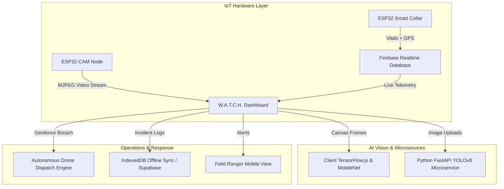

# 🌿 W.A.T.C.H. – Wildlife AI Tracking & Conservation Hub

[](https://nextjs.org/)
[](https://reactjs.org/)
[](https://www.tensorflow.org/js)
[](https://ultralytics.com/)
[](https://firebase.google.com/)
[](LICENSE)

**W.A.T.C.H. (Wildlife AI Tracking & Conservation Hub)** is an end-to-end AI and IoT platform built to modernize wildlife monitoring, anti-poaching operations, animal health surveillance, and emergency response.

The system combines wearable smart IoT collars, remote ESP32-CAM field nodes, real-time computer vision models (TensorFlow.js & YOLOv8), autonomous drone dispatch simulation, and cloud dashboards for forest rangers, veterinarians, and conservation authorities.

---

## 📸 Key Features

### 1. 👁️ Live AI Field Node & ESP32-CAM Integration
* **Dual Camera Feeds**: Switch seamlessly between local webcam testing and remote **ESP32-CAM** field nodes.
* **Auto-Probing & Diagnostics**: Verifies stream connectivity with instant feedback (`ESP32 CAM CONNECTED` vs `ESP32 NOT FOUND`).
* **In-Browser AI Classification**: Detects Elephants, Lions, Rhinos, Tigers, Gorillas, and alerts instantly on **Unauthorized Humans / Poachers**.
* **Stream Auto-Recording**: Built-in `MediaRecorder` captures live MJPEG streams, records incidents with live HUD timers, and exports timestamped `.webm` video logs.

### 2. 🛰️ IoT Smart Collar Telemetry (Firebase RTDB)
* **Live Vital Signs**: Real-time heart rate (MAX30102), body temperature (DS18B20), and motion stress levels (MPU6050).
* **GPS Tracking**: Real-time geolocation tracking using NEO-6M GPS modules.
* **Abnormal Distress Detection**: Cloud-based anomaly detection for animal injury, fever, or tachycardia.

### 3. 🚁 Autonomous Drone Threat Response & Geofencing
* **Virtual Geofencing**: Polygon sector monitoring with breach detection.
* **Autonomous Drone Dispatch**: Automatically plans intercept trajectories and deploys surveillance drones when an animal breaches the reserve perimeter or a poacher is sighted.
* **Real-time Incident Feed**: Event stream linking cameras, drones, and field rangers.

### 4. 📋 Field Ranger Operations & Offline PWA Sync
* **Offline-First Storage**: IndexedDB storage ensures field rangers can record animal sightings and incidents deep in the forest without cellular coverage.
* **Auto-Sync**: Automatically syncs offline observations to the cloud once network connectivity is restored.
* **Role-Based Access Control (RBAC)**: Distinct permissions for Administrators, Rangers, Researchers, Veterinarians, and Drone Operators.

### 5. 💬 AI Conservation Assistant & Analytics
* **Natural Language Assistant**: Integrated LLM chat for species inquiries and conservation guidelines.
* **Health Trends & Reports**: Visual charts for activity patterns, vitals history, and automated PDF incident reports.

---

## 🛠️ System Architecture



---

## ⚙️ Hardware Components

| Component | Function | Interface / Protocol |
|---|---|---|
| **ESP32 Microcontroller** | Central sensor processing & telemetry gateway | Wi-Fi / BLE |
| **ESP32-CAM (OV2640)** | Remote optical field monitoring | HTTP MJPEG Stream / RTSP |
| **NEO-6M GPS Module** | Animal coordinate and movement tracking | UART Serial |
| **MAX30102 Sensor** | Photoplethysmography (Heart rate & SpO2) | I2C |
| **MPU6050 Sensor** | 6-Axis Accelerometer & Gyroscope (Behavior/Motion) | I2C |
| **DS18B20 Sensor** | High-precision animal body temperature | 1-Wire Digital |
| **TP4056 + Li-Po 3.7V** | Rechargeable power management | Hardware |
| **MT3608 Boost Converter** | 5V voltage step-up regulation | Hardware |

---

## 💻 Software Tech Stack

* **Frontend**: Next.js 16 (Turbopack, App Router), React 18, Tailwind CSS, Lucide Icons, Radix UI.
* **Client AI**: TensorFlow.js, Teachable Machine Image, MobileNet v2.
* **Backend AI**: Python 3.10+, FastAPI, Ultralytics YOLOv8 (`yolov8n.pt`, `best.pt`), Pillow.
* **Cloud Databases**: Firebase Realtime Database & Supabase.
* **Offline Storage**: IndexedDB (Native Web API).

---

## 🚀 Getting Started

### 1. Clone the Repository
```bash
git clone https://github.com/kartik3174/W.A.T.C.H-AI-NEW.git
cd W.A.T.C.H-AI-NEW
```

### 2. Install Dependencies
```bash
npm install
```

### 3. Configure Environment Variables
Create a `.env` file in the root directory:
```env
NEXT_PUBLIC_FIREBASE_API_KEY=your_firebase_api_key
NEXT_PUBLIC_FIREBASE_AUTH_DOMAIN=your_project.firebaseapp.com
NEXT_PUBLIC_FIREBASE_DATABASE_URL=https://your_project-default-rtdb.firebaseio.com
NEXT_PUBLIC_FIREBASE_PROJECT_ID=your_project_id
NEXT_PUBLIC_FIREBASE_STORAGE_BUCKET=your_project.firebasestorage.app
NEXT_PUBLIC_FIREBASE_MESSAGING_SENDER_ID=your_sender_id
NEXT_PUBLIC_FIREBASE_APP_ID=your_app_id
NEXT_PUBLIC_FIREBASE_MEASUREMENT_ID=your_measurement_id

# Optional: Python AI Server & OpenAI Key
YOLO_SERVER_URL=http://127.0.0.1:8000
OPENAI_API_KEY=your_openai_key
```

### 4. Run the Development Server
```bash
npm run dev
```
Open [http://localhost:3000](http://localhost:3000) in your browser.

---

## 🧠 (Optional) Run the YOLOv8 Python Backend

To run the custom YOLOv8 detection server:
```bash
cd AI
pip install fastapi uvicorn ultralytics pillow
uvicorn server:app --host 127.0.0.1 --port 8000 --reload
```

---

## 📁 Project Structure

```
├── AI/                          # Python YOLOv8 microservice & model weights
│   ├── server.py               # FastAPI inference backend
│   └── best.pt                 # Custom wildlife model weights
├── app/                        # Next.js App Router pages & API routes
│   ├── ai-monitoring/          # Live AI camera monitoring interface
│   ├── animals/                # Wildlife profiles, vitals, health records
│   ├── anti-poaching/          # Threat heatmaps & intelligence
│   ├── api/                    # /detect, /sensor-data, /chat
│   ├── drone-response/         # Autonomous drone dispatch engine
│   └── tracking/               # Real-time reserve map & telemetry
├── components/                 # Reusable UI & subsystem components
│   ├── AiMonitor.js            # Dual camera feed & AI HUD controller
│   ├── geofence/               # Geofence breach alerts & status
│   └── tracking/               # Live incident feed & drone command
├── lib/                        # Service layers & database clients
│   ├── Firebase.ts             # Firebase app initialization
│   ├── firebase-rtdb.ts        # Real-time IoT collar telemetry service
│   ├── field-ranger-service.ts # Offline-first IndexedDB manager
│   └── supabase.ts             # Supabase client
└── public/                     # Static assets, TFJS models & icons
```

---

## 👨‍💻 Author

**Kartik Singh**
* GitHub: [@kartik3174](https://github.com/kartik3174)
* Project: [W.A.T.C.H-AI-NEW](https://github.com/kartik3174/W.A.T.C.H-AI-NEW)

---

## 📄 License
This project is licensed under the [MIT License](LICENSE).
